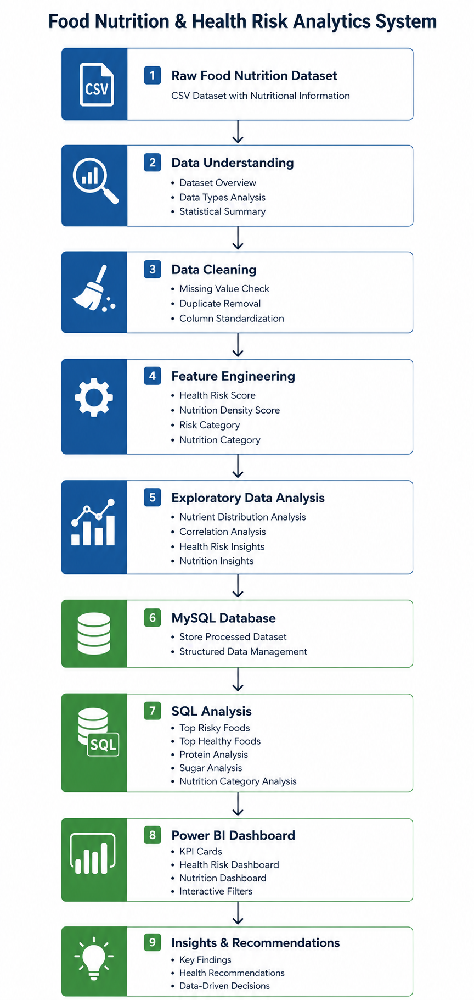

# 🍎 Food Nutrition & Health Risk Analytics System

> An end-to-end Data Analytics project focused on analyzing food nutrition data, identifying health risks, and generating actionable insights using Python, SQL, MySQL, and Power BI.

---

## 🚧 Project Status

**Current Stage:** Data Understanding, Data Cleaning, and Feature Engineering

This project is currently under development and follows a structured analytics workflow from raw nutritional data to business intelligence dashboards and health recommendations.

---

# 🏗️ Project Workflow

<p align="center">
  
</p>

---

## 🎯 Project Objective

The goal of this project is to:

- Analyze food nutritional information
- Create meaningful health risk metrics
- Identify healthy and risky food patterns
- Perform SQL-based analytical queries
- Build interactive Power BI dashboards
- Generate data-driven health insights

---

## 📂 Project Structure

```text
Food/
│
├── dataset/
│
├── notebooks/
│   ├── data-understanding-and-cleaning.ipynb
│   └── feature-engineering.ipynb
│
├── Workflow/
│   └── Food-Health-Risk-Workflow.png
│
└── README.md
```

---

## 📊 Dataset

The dataset contains nutritional information for various food items.

### Available Features

- Food Item
- Energy (kcal)
- Carbohydrates
- Protein
- Fat
- Free Sugar
- Fibre
- Cholesterol
- Calcium

---

## ✅ Progress Tracker

### Phase 1: Data Understanding
- [x] Dataset Exploration
- [x] Column Analysis
- [x] Statistical Summary

### Phase 2: Data Cleaning
- [x] Missing Value Analysis
- [x] Duplicate Detection
- [x] Data Standardization

### Phase 3: Feature Engineering
- [x] Health Risk Score Creation
- [x] Nutrition Density Score Creation
- [x] Risk Category Generation
- [x] Nutrition Category Generation

### Phase 4: Exploratory Data Analysis
- [ ] Nutrient Distribution Analysis
- [ ] Correlation Analysis
- [ ] Health Risk Insights
- [ ] Nutrition Insights

### Phase 5: Database Integration
- [ ] MySQL Database Setup
- [ ] Data Import
- [ ] Table Design

### Phase 6: SQL Analytics
- [ ] Top Risky Foods Analysis
- [ ] Top Healthy Foods Analysis
- [ ] Protein Analysis
- [ ] Sugar Analysis
- [ ] Nutrition Category Analysis

### Phase 7: Power BI Dashboard
- [ ] KPI Dashboard
- [ ] Health Risk Dashboard
- [ ] Nutrition Dashboard
- [ ] Interactive Filtering

### Phase 8: Insights & Recommendations
- [ ] Business Insights
- [ ] Health Recommendations
- [ ] Final Report

---

## ⚙️ Feature Engineering Implemented

### Health Risk Score

A custom score designed to estimate potential health risks using nutritional attributes such as:

- Calories
- Fat
- Free Sugar
- Cholesterol

### Nutrition Density Score

A metric developed to evaluate nutritional quality using:

- Protein
- Fibre
- Calcium

### Categories Created

#### Risk Categories

- Low Risk
- Medium Risk
- High Risk

#### Nutrition Categories

- Nutrient Dense
- Moderately Nutritious
- Less Nutritious

---

## 🔜 Upcoming Work

The next steps in the project are:

1. Exploratory Data Analysis (EDA)
2. Correlation Analysis
3. MySQL Integration
4. SQL Business Queries
5. Power BI Dashboard Development
6. Insight Generation

---

## 🛠️ Tech Stack

### Data Processing
- Python
- Pandas
- NumPy

### Visualization
- Matplotlib
- Seaborn

### Database
- MySQL

### Analytics
- SQL

### Dashboarding
- Power BI

### Development Environment
- PyCharm
- Jupyter Notebook

---

## 📅 Development Roadmap

| Stage | Status |
|---------|---------|
| Data Understanding | ✅ Completed |
| Data Cleaning | ✅ Completed |
| Feature Engineering | ✅ Completed |
| Exploratory Data Analysis | 🔄 In Progress |
| MySQL Integration | ⏳ Planned |
| SQL Analytics | ⏳ Planned |
| Power BI Dashboard | ⏳ Planned |
| Final Insights | ⏳ Planned |

---

## 👨‍💻 Author

**Samhoon**

Data Analytics | SQL | Power BI | Python

Building an end-to-end analytics project focused on nutrition intelligence and health risk assessment.

---

⭐ Project currently under active development.