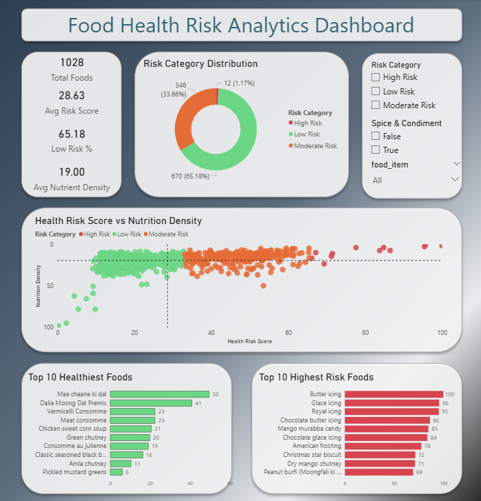

# 🍎 Food Nutrition & Health Risk Analytics System

> An end-to-end Data Analytics project focused on analyzing food nutrition data, identifying health risks, and generating actionable insights using Python, SQL, MySQL, and Power BI.

---

## 🚧 Project Status

**Current Stage:** Power BI Dashboard Completed | EDA and Insight Generation In Progress

This project follows a complete analytics workflow from raw nutritional data to health intelligence and interactive business dashboards.

---

# 🏗️ Project Workflow

<p align="center">
  
</p>

---

## 📊 Dashboard Preview

<p align="center">
  
</p>

The Power BI dashboard provides an interactive view of food health risk metrics, nutrition density, risk categorization, and healthy versus high-risk food analysis.

---

## 🎯 Project Objective

The goal of this project is to:

* Analyze food nutritional composition
* Create custom health-related metrics
* Identify healthy and high-risk food patterns
* Perform SQL-based analytical exploration
* Build interactive Power BI dashboards
* Generate actionable nutrition insights

---

## 📂 Project Structure

```text
Food/
│
├── dashboard/
│   ├── dashboard-overview.png
│   └── food-health.pbix
│
├── dataset/
│
├── notebooks/
│   ├── data-understanding-and-cleaning.ipynb
│   ├── feature-engineering.ipynb
│   └── Food_Nutrition.csv
│
├── sql/
│   └── nutrition_analysis.sql
│
├── Workflow/
│   └── Food-Health-Risk-Workflow.png
│
├── .gitignore
└── README.md
```

---

## 📊 Dataset

The dataset contains nutritional information for more than 1,000 food items.

### Available Features

| Column             | Category                   |
| ------------------ | -------------------------- |
| food_item          | Identifier                 |
| energy_kcal        | Context Dependent          |
| carbs              | Context Dependent          |
| protein_g          | Positive                   |
| fat_g              | Negative When High         |
| free_sugar_g       | Negative When High         |
| fibre_g            | Positive                   |
| cholesterol_mg     | Negative When High         |
| calcium_mg         | Positive                   |
| nutrition_density  | Engineered Positive Metric |
| health_risk_score  | Engineered Negative Metric |
| is_spice_condiment | Analytical Flag            |

---

## ⚙️ Feature Engineering Implemented

### Nutrition Density

A custom metric designed to evaluate nutritional quality using:

* Protein
* Fibre
* Calcium
* Sugar
* Fat
* Calories
* Cholesterol

Higher values indicate better nutritional quality.

---

### Health Risk Score

A custom metric designed to estimate potential health risk using:

* Free Sugar
* Fat
* Calories
* Cholesterol
* Protein
* Fibre

Higher values indicate higher health risk.

---

### Additional Features

#### Spice / Condiment Classification

A binary flag:

```text
is_spice_condiment
```

was created to prevent spices and seasoning blends from distorting nutritional rankings due to per-100g measurements.

---

## 🗄️ SQL Analytics Completed

A total of 15 business-focused SQL analyses were performed, including:

* Highest Protein Foods
* Most Nutrient Dense Foods
* Highest Health Risk Foods
* Highest Sugar Foods
* High Fat & High Sugar Foods
* High Nutrition, Low Risk Foods
* Calcium-Rich Low-Risk Foods
* High Fibre, Low Sugar Foods
* High Protein, Low Risk Foods
* Lowest Health Risk Foods
* Best Protein-to-Calorie Ratio Foods
* Health Risk Distribution Analysis
* Above-Average Healthy Foods
* Overall Healthiest Foods Ranking

All SQL queries are available in:

```text
sql/nutrition_analysis.sql
```

---

## 📈 Power BI Dashboard Features

The completed dashboard includes:

### KPI Cards

* Total Foods
* Average Risk Score
* Low Risk Percentage
* Average Nutrition Density

### Interactive Visualizations

* Risk Category Distribution
* Health Risk Score vs Nutrition Density Analysis
* Top 10 Healthiest Foods
* Top 10 Highest Risk Foods

### Interactive Filters

* Risk Category
* Food Item
* Spice & Condiment Classification
* Energy (kcal) Range

---

## 📊 Key Insights Generated

* Majority of foods fall under the Low Risk category.
* Nutrition Density generally decreases as Health Risk Score increases.
* Spices and condiments significantly influence nutritional rankings.
* Several processed foods exhibit extremely high health risk scores.
* Traditional spice blends and condiments rank among the healthiest food items based on nutritional density.

---

## ✅ Progress Tracker

### Phase 1: Data Understanding

* [x] Dataset Exploration
* [x] Column Analysis
* [x] Statistical Summary

### Phase 2: Data Cleaning

* [x] Missing Value Analysis
* [x] Duplicate Detection
* [x] Data Standardization

### Phase 3: Feature Engineering

* [x] Nutrition Density Score
* [x] Health Risk Score
* [x] Risk Categorization
* [x] Spice/Condiment Classification

### Phase 4: Database Integration

* [x] MySQL Database Setup
* [x] Data Import
* [x] SQL Query Development

### Phase 5: SQL Analytics

* [x] Business Questions Analysis
* [x] Health Risk Exploration
* [x] Nutritional Insights Generation
* [x] Healthy Food Ranking

### Phase 6: Exploratory Data Analysis

* [ ] Nutrient Distribution Analysis
* [ ] Correlation Analysis
* [ ] Outlier Detection
* [ ] Statistical Insights

### Phase 7: Power BI Dashboard

* [x] KPI Dashboard
* [x] Health Risk Dashboard
* [x] Nutrition Dashboard
* [x] Interactive Filters
* [x] Risk Category Analysis
* [x] Top Healthy Foods Analysis
* [x] Top High-Risk Foods Analysis

### Phase 8: Insights & Recommendations

* [ ] Dashboard Insights
* [ ] Health Recommendations
* [ ] Final Report

---

## 🔜 Upcoming Work

1. Exploratory Data Analysis (EDA)
2. Correlation Analysis
3. Dashboard Insight Generation
4. Nutrition Intelligence Reporting
5. Health Risk Recommendations
6. Final Project Documentation

---

## 🛠️ Tech Stack

### Data Processing

* Python
* Pandas
* NumPy

### Database

* MySQL
* SQL

### Visualization

* Matplotlib
* Seaborn
* Power BI

### Development

* Jupyter Notebook
* Git
* GitHub

---

## 📅 Development Roadmap

| Stage                      | Status         |
| -------------------------- | -------------- |
| Data Understanding         | ✅ Completed    |
| Data Cleaning              | ✅ Completed    |
| Feature Engineering        | ✅ Completed    |
| MySQL Integration          | ✅ Completed    |
| SQL Analytics              | ✅ Completed    |
| Exploratory Data Analysis  | 🔄 In Progress |
| Power BI Dashboard         | ✅ Completed    |
| Final Insights & Reporting | ⏳ Planned      |

---

## 👨‍💻 Author

**Samhoon**

Aspiring Data Analyst | Python | SQL | Power BI

Building an end-to-end analytics project focused on nutrition intelligence, health risk assessment, and data-driven decision making.

---

⭐ Project currently under active development.
